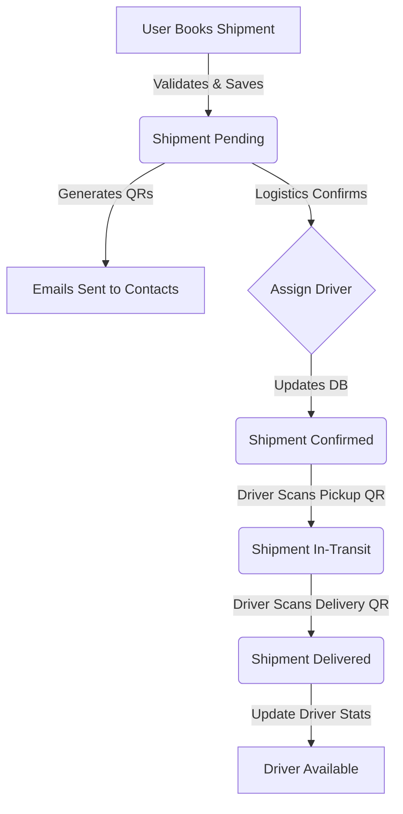
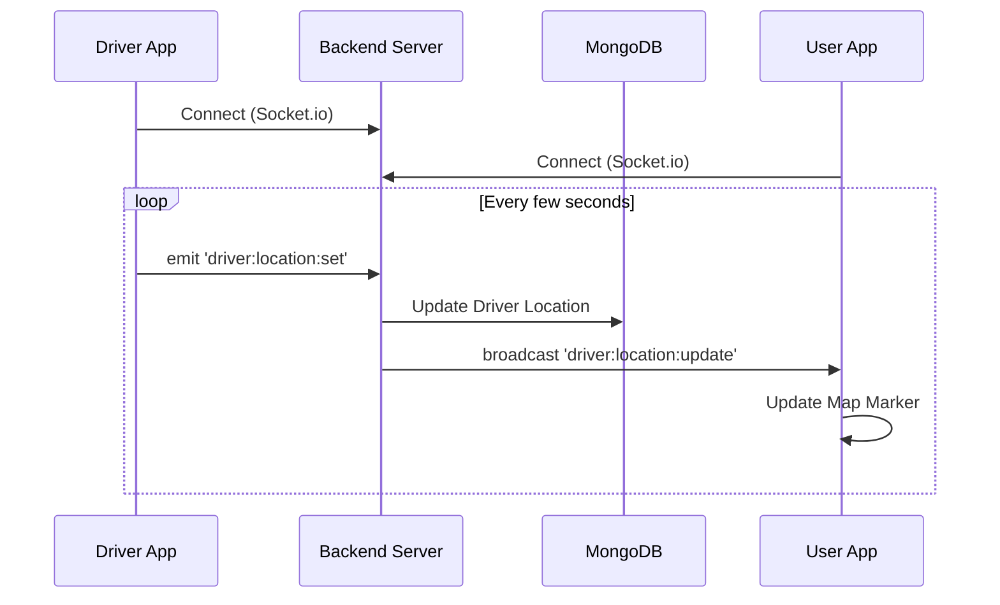

# FastFare Backend

FastFare is a logistics and shipment management platform connecting users, drivers, and logistics providers. This backend service handles authentication, shipment booking, real-time driver tracking, and data management.

## 🚀 Overview

The backend is built with **Node.js**, **Express**, and **TypeScript**, using **MongoDB** for data persistence. It features:

- **Role-based Authentication**: Secure login for Users, Admins, Logistic Providers, and Drivers using JWT.
- **Shipment Management**: Booking, tracking, and managing shipments with QR code validation for pickup and delivery.
- **Real-time Tracking**: Socket.io integration for live driver location updates.
- **Secure API**: Protected by Helmet and CORS, with environment-based configuration.

## 🛠️ Tech Stack

- **Runtime**: Node.js
- **Framework**: Express.js
- **Language**: TypeScript
- **Database**: MongoDB (Mongoose)
- **Real-time**: Socket.io
- **Authentication**: JSON Web Tokens (JWT) & Bcrypt
- **Tools**: Nodemon (via `tsx` watch), Dotenv

## 📂 Project Structure

```
src/
├── controllers/    # Request handlers for API routes
├── db/            # Database connection logic
├── middlewares/    # Auth and error handling middlewares
├── models/         # Mongoose schemas (User, Shipment, Details)
├── routes/         # API route definitions
├── services/       # Business logic layers
├── sockets/        # Socket.io handlers for real-time tracking
└── utils/          # Helper functions and configuration
```

## ⚡ Getting Started

### Prerequisites

- Node.js (v18+ recommended)
- MongoDB (Local or Atlas URI)

### Installation

1.  Clone the repository:

    ```bash
    git clone <repository-url>
    cd fastfare-backend
    ```

2.  Install dependencies:

    ```bash
    npm install
    ```

3.  Configure environment variables:
    Create a `.env` file in the root directory (refer to `src/utils/envConfig.ts` for required keys, typically `PORT`, `MONGO_URI`, `JWT_SECRET`).

### Running the Project

- **Development Mode** (with hot-reload):

  ```bash
  npm run dev
  ```

- **Build for Production**:

  ```bash
  npm run build
  ```

- **Start Production Server**:
  ```bash
  npm start
  ```

## 🔗 API Flow & Features

### 1. Authentication

- **POST** `/api/v1/login`: Authenticates users, admins, drivers, and logistics providers. Returns a JWT token.
- **GET** `/api/v1/fetchdetail`: Uses the JWT to retrieve role-specific details (e.g., User profile, Admin stats, Logistic company info).

### 2. User Operations

- **POST** `/api/v1/user/order/book`: Users book a new shipment.
  - **Inputs**: Pickup/Delivery locations, size, weight, price.
  - **Process**:
    1.  Validates all inputs.
    2.  Creates a Shipment record (Status: `pending`).
    3.  Generates two QR tokens: `pickupQrToken` and `deliveryQrToken`.
    4.  Generates QR code images.
    5.  Sends emails to Pickup and Delivery contacts with the respective QR codes.
  - **Outputs**: Created Shipment object.
- **GET** `/api/v1/user/order/get/:shipmentId`: View shipment details.

### 3. Logistics & Driver Management

- **POST** `/api/v1/logistic/register`: Register a new Logistics Company.
- **POST** `/api/v1/logistic/driver/add`: Logistics Provider adds a new driver.
  - **Process**:
    1.  Checks for existing driver/user.
    2.  Creates a `User` account (Role: `driver`) with a temporary password.
    3.  Creates a `DriverDetails` record linked to the Logistics Provider.
    4.  Sends an email to the driver with login credentials.
- **POST** `/api/v1/logistic/shipment/confirm`: Logistics Provider assigns a driver to a shipment.
  - **Process**:
    1.  Updates Shipment status to `confirmed`.
    2.  Assigns `DriverId` to the shipment.
    3.  Sets Driver status to `on-duty` and increments `currentOrders`.

### 4. Driver Operations (Scanning)

- **POST** `/api/v1/logistic/shipment/scan`: Driver scans QR codes to update status.
  - **Pickup**: Driver scans `pickupQrToken`. Shipment status updates to `in-transit`.
  - **Delivery**: Driver scans `deliveryQrToken`. Shipment status updates to `delivered`.
  - **Completion**: When delivered, Driver's `currentOrders` is decremented. If 0, Driver status becomes `available`.

### 5. Real-time Driver Tracking (Socket.io)

- **Connection**: Clients (User App, Driver App) connect to the server root.
- **Event: `driver:location:set`**:
  - **Source**: Driver App.
  - **Payload**: `{ userId, latitude, longitude }`.
  - **Action**: Updates `DriverDetails` in DB.
- **Event: `driver:location:update`**:
  - **Source**: Server (Broadcast).
  - **Payload**: `{ userId, latitude, longitude }`.
  - **Action**: Sent to all connected clients to update the driver's position on the map live.

## 🏗️ System Architecture & Flow

### Shipment Lifecycle



### Real-time Tracking Flow



## 📝 Usage Example

1.  **Register/Login** to get a valid `token`.
2.  **Book Shipment**: User calls `/api/v1/user/order/book`. Emails are sent.
3.  **Assign Driver**: Logistics provider calls `/api/v1/logistic/shipment/confirm`.
4.  **Pickup**: Driver scans QR at pickup location using `/api/v1/logistic/shipment/scan`.
5.  **Track**: User connects to Socket.io to see driver moving.
6.  **Delivery**: Driver scans QR at delivery location.
